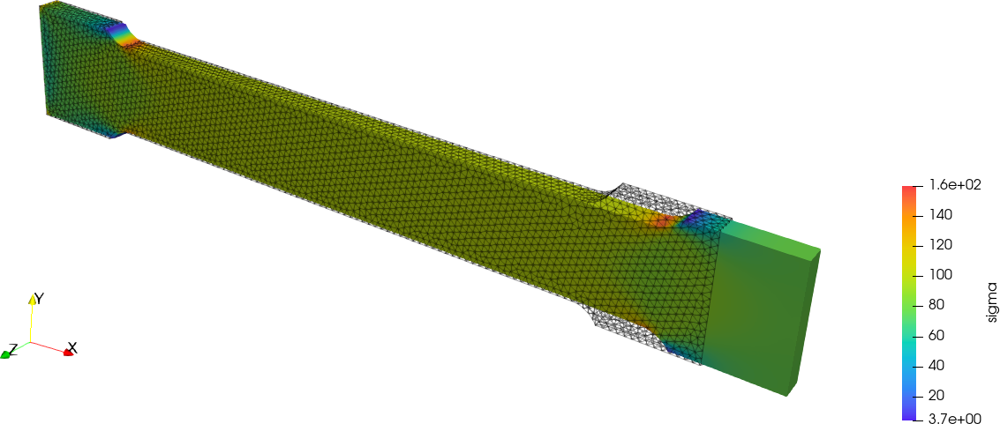

% Fino: a partial differential equation solver based on the finite element method

{.img-responsive}\ 


[Fino](https://www.seamplex.com/fino) is a free and open source tool to solve partial differential equations using the finite element method. It is particularly designed to handle linear elastic problems, natural frequency analysis and heat conduction but arbirtary equations may be included. The domain over which the PDE is solved (which can be either one, two or three-dimensional) should be a grid generated by [Gmsh](http://geuz.org/gmsh/). The material properties (i.e. the coefficientes of the PDE) may involve arbitrary dependence of space associated to volumetric physical entities defined in the mesh. Dirichlet, Neumann and/or Robin boundary conditions can be given as algebraic functions of space and are also associated to surface physical entities.

Fino follows, amongst [others](https://www.seamplex.com/principles.html), the [UNIX philosophy](https://en.wikipedia.org/wiki/Unix_philosophy). Fino is a back-end aimed at advanced users. For a web-based fronted with Fino running on the cloud, see [CAEplex](https://www.caeplex.com)

[{.img-responsive}](https://www.caeplex.com)

# Quick start

If you are impatient to run Fino, open a terminal in any GNU/Linux box (may be a VirtualBox box) and run:

```
curl https://www.seamplex.com/fino/get.sh | sh
```

Make sure you have `curl` installed and if you are behind a proxy, that both `http_proxy` and `https_proxy` are properly set. If you get any error, either

 a. See the detailed explanation in [INSTALL](INSTALL.md)  
 b. Ask for help in the mailing list at <https://groups.google.com/a/seamplex.com/forum/#!forum/wasora>

If these instructions are non-sense to you, go directly to point b.

# Examples

## Tensile test 

Let us consider the example input file [`examples/tensile-test.fin`](examples/tensile-test.fin):

```wasora
MESH FILE_PATH tensile-test-specimen.msh   # mesh file in Gmsh format

# uniform properties
E = 2e5   # Young modulus
nu = 0.3  # Poisson ratio

# boundary conditions (the names come from the physical entities in the mesh)
PHYSICAL_ENTITY NAME left  BC fixed
PHYSICAL_ENTITY NAME right BC tx=0.002*E*(10/13)   # traction
# PHYSICAL_ENTITY NAME right BC u=0 v=0 w=1        # displacement

# print some data
PRINT TEXT "elements                    =" %g elements
PRINT TEXT "nodes                       =" %g nodes

FINO_STEP

# results
MESH_POST FILE_PATH tensile-test.vtk sigma sigma1 sigma2 sigma3 VECTOR u v w

PRINT TEXT "maximum_diplacement   [mm]  =" %g displ_max
PRINT TEXT "stress_at_the_origin  [MPa] =" %g sigma(0,0,0)
PRINT TEXT "reaction_at_fixed_end [N]   =" %g TEXT "Rx ="  R_left_x TEXT "Ry =" R_left_y TEXT "Rz =" R_left_z
PRINT FILE_PATH tensile-sigma.dat %.0f sigma(0,0,0)
```

We can run it with Fino like this:

```bash
$ fino tensile-test.fin 
elements                    =   3356
nodes                       =   1178
maximum_diplacement   [mm]  =   0.30163
stress_at_the_origin  [MPa] =   399.999
reaction_at_fixed_end [N]   =   Rx =    -40000  Ry =    8.99532e-09     Rz =    -8.00355e-11
$ 
```

We can process the `VTK` output file with the free tool [ParaView](http://www.paraview.org/):

{.img-responsive}\ 


See the directory `examples` for further cases.

## Conic valve

Can your solver constrain your model faces to algebraically-defined surfaces such as cones? Ours can (and it is open source):

[{.img-responsive}](https://twitter.com/seamplex/status/789440535329181696)\ 

```wasora
SHELL "gmsh -v 0 -3 conic_valve.geo"
MESH FILE_PATH conic_valve.msh DIMENSIONS 3

E = 200e3
nu = 0.3

FINO_SOLVER PC_TYPE lu KSP_TYPE gmres

PHYSICAL_ENTITY NAME base  BC u=0 v=1e-2 w=0
PHYSICAL_ENTITY NAME top   BC u=0 v=1e-2 w=0

# the cone equation
x1 = -4
y1 = 2

x2 = -2
y2 = 4

f(x) := (y2-y1)/(x2-x1)*(x-x1) + y1
h = f(0)
r = root(f(x), x, -10, 0) 

PHYSICAL_ENTITY NAME cone  BC implicit=((x+u)^2+(z+w)^2)/(r/h)^2-(y+v-h)^2

FINO_STEP
MESH_POST FILE_PATH conic_valve.vtk sigma VECTOR u v w dudx dvdx dwdx dudy dvdy dwdy dudz dvdz dwdz 
```

See the original tweet at <https://twitter.com/seamplex/status/789440535329181696>


# Licensing

Fino is distributed under the terms of the [GNU General Public License](http://www.gnu.org/copyleft/gpl.html) version 3 or (at your option) any later version.


# Further information

Home page: <https://www.seamplex.com/fino>  
Repository: <https://bitbucket.org/seamplex/fino>  
Mailing list and bug reports: <wasora@seamplex.com>  (you need to subscribe first at <wasora+subscribe@seamplex.com>)  
Follow us: [Twitter](https://twitter.com/seamplex/) [YouTube](https://www.youtube.com/channel/UCC6SzVLxO8h6j5rLlfCQPhA) [LinkedIn](https://www.linkedin.com/company/seamplex/) [Bitbucket](https://bitbucket.org/seamplex/)

---------------------------

fino is copyright (C) 2014-2017 Jeremy Theler  
fino is licensed under [GNU GPL version 3](http://www.gnu.org/copyleft/gpl.html) or (at your option) any later version.  
fino is free software: you are free to change and redistribute it.  
There is NO WARRANTY, to the extent permitted by law.  
See the file `COPYING` for copying conditions.  
